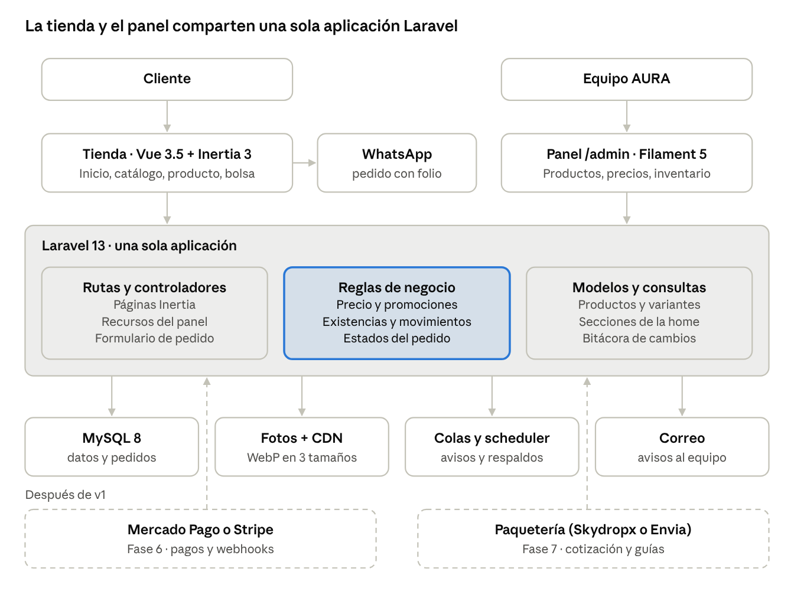
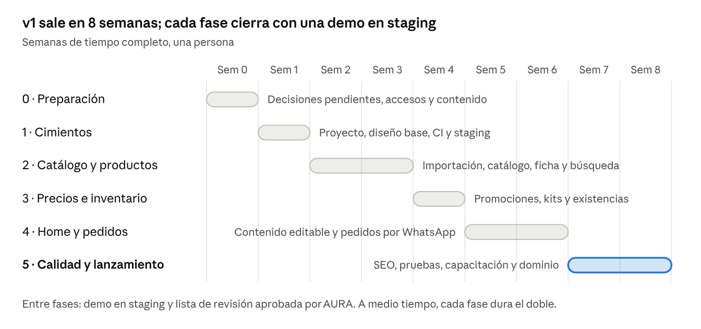

# AURA v2 · Plan de desarrollo

2 oct 2026 · Propuesta para migrar la tienda a Laravel 13 + Vue

> Documento vivo (con comentarios): https://claude.ai/code/artifact/71c50e2b-37e2-4d4e-b52a-976d4764474f
> Prototipo navegable: [`prototipo/aura-luxury-v2.html`](prototipo/aura-luxury-v2.html) · en línea: https://claude.ai/artifact/ASCTSrmwGY6BPV5BxLe4zU

## Resumen

La propuesta es reconstruir la tienda de AURA como una aplicación Laravel 13 con tienda en Vue y un panel de administración. La primera versión sale en unas **8 semanas** de trabajo de tiempo completo y resuelve dos cosas: mostrar bien el catálogo y que el equipo lo administre sin tocar código.

- **Primera entrega (v1):** escaparate con el diseño "escaparate claro" del prototipo, panel para productos, fotos, precios, promociones, inventario y contenido, y pedidos que se registran en el sistema y se cierran por WhatsApp.
- **Después de v1:** pasarela de pago (Mercado Pago o Stripe), envíos con cotización por código postal y cuentas de cliente. El sistema queda preparado para conectarlos sin rehacer nada.
- **Sin Dolibarr:** Laravel es la única fuente de datos. El repositorio actual se usa solo como origen del catálogo y las fotos.

Las secciones de la página de inicio que en el prototipo cambian solas con "Simular próxima semana" fueron una demostración; en v1 las controla el equipo desde el panel.

## Alcance de v1

v1 es un escaparate administrable con pedidos por WhatsApp; no cobra en línea ni calcula envíos todavía.

| Área | Entra en v1 | Queda para después |
| --- | --- | --- |
| Tienda | Inicio, catálogo con filtros, ficha de producto, búsqueda, bolsa, favoritos, guía de tallas, páginas informativas | Reseñas, comparador, recomendaciones personalizadas |
| Pedidos | Bolsa → formulario corto → pedido registrado con folio → mensaje de WhatsApp prellenado | Pago en línea y confirmación automática |
| Panel | Productos, variantes, fotos, categorías, colecciones, precios, promociones, inventario, pedidos, contenido de la home, usuarios y roles | Reportes avanzados, CRM |
| Envíos | Tarifas fijas configurables y envío gratis desde un monto | Cotización por código postal y guías con paquetería |
| Clientes | Datos del pedido (nombre, celular, ciudad) | Cuentas, direcciones guardadas, historial |
| Marketing | Lista de correo, avisos de reabastecimiento, Open Graph para compartir | Cupones, campañas por correo, catálogo para Instagram y Google |

Quedan fuera de todo el proyecto, salvo que se decida lo contrario: Dolibarr, facturación electrónica (CFDI) y app móvil.

## Punto de partida

La tienda actual pesa unos 23 MB y no se puede administrar; se conserva la marca, el catálogo y varias ideas de experiencia, y se reemplaza el resto.

| Hallazgo en el repo `aura-luxury` | Qué pasa en v2 |
| --- | --- |
| `index.html` (7.7 MB) y `js/main.js` (15.2 MB) llevan las fotos incrustadas en base64 | Fotos en almacenamiento con tamaños por pantalla y formato WebP |
| 24 registros de producto escritos a mano en `main.js`; 43 scripts de Python para editarlos | Productos en base de datos, editados desde el panel |
| El carrito arma un texto para WhatsApp o Instagram; no queda registro | Cada pedido se guarda con folio y estado antes de abrir WhatsApp |
| Tailwind por CDN (compila en el navegador) | Tailwind compilado con Vite |
| Dolibarr completo (657 MB) y el módulo AuraShop en el mismo repo | Repositorio nuevo solo para la tienda |
| Algodón descrito como 450, 320 y 280 GSM; kit con "ahorra $200" y tachado de $1,490 cuando las piezas suman $1,280 | Ficha técnica única por producto y precios tachados solo con historial real |

**Se conserva:** logo y corona plateada, número de WhatsApp +52 55 1606 9816 e Instagram @tropiezo_mx, envío gratis desde $1,200, tabla de tallas con calculadora por altura y peso, favoritos, vistos recientemente y el trabajo de accesibilidad. Del módulo AuraShop se reutilizan dos decisiones: dinero en centavos y mostrar disponibilidad sin exponer cantidades exactas.

## Stack y decisiones técnicas

La base es el starter kit oficial de Vue de Laravel 13, porque ya trae Inertia, Vue, TypeScript, Tailwind y autenticación conectados y mantenidos por el equipo de Laravel; es lo más rápido y lo más estable para arrancar.

| Pieza | Elección | Por qué |
| --- | --- | --- |
| Framework | Laravel 13 (PHP 8.3 o superior) | Versión actual, publicada el 17 de marzo de 2026, con correcciones hasta el tercer trimestre de 2027 y seguridad hasta marzo de 2028 |
| Arranque | `laravel new aura-store` → starter kit de Vue | Trae Inertia 3, Vue 3, TypeScript, Tailwind y componentes shadcn-vue ya configurados |
| Tienda | Vue 3.5 con Inertia 3 | Un solo repositorio, rutas en Laravel, páginas en Vue; Vue 3.6 sigue en versión candidata |
| Estilos | Tailwind CSS 4 (viene en el kit) | Los tokens del prototipo pasan a `@theme` en `app.css` |
| Panel | Filament 5 en `/admin` | Tablas, filtros, formularios, carga de fotos y roles listos; construirlo a mano en Vue tomaría de 2 a 3 veces más |
| Autenticación | Fortify (viene en el kit) con 2FA para el personal | Inicio de sesión, recuperación de contraseña y límites de intentos |
| Base de datos | MySQL 8 | Disponible en cualquier hosting; el repo actual ya usa MariaDB |
| Fotos | spatie/laravel-medialibrary | Genera miniaturas y WebP al subir, con srcset |
| Roles | spatie/laravel-permission (Filament Shield) | Administrador, catálogo, inventario y pedidos |
| Bitácora | spatie/laravel-activitylog | Quién cambió un precio o el stock y cuándo |
| Ajustes | spatie/laravel-settings | WhatsApp, umbral de envío gratis, redes, textos fijos |
| Búsqueda | Laravel Scout con driver de base de datos | Suficiente para unos cientos de productos; se cambia a Meilisearch si crece |
| Estado en el navegador | Pinia | Bolsa y favoritos guardados en el navegador |
| Carruseles | embla-carousel-vue | Ligero y accesible |

**Decisiones tomadas:** no se usa Dolibarr; Filament es una tecnología distinta a Vue (Livewire), pero vive aislado en `/admin` y no afecta a la tienda. **Verificar al instalar:** que las versiones de Filament y de los paquetes de Spatie acepten Laravel 13 (Filament 5 se instala con la restricción `^5.0`).

## Arquitectura

Tienda y panel son dos caras de una sola aplicación Laravel: comparten modelos y reglas, así que un precio cambiado en el panel es el mismo que ve el cliente.



Las reglas de negocio (al centro) son clases pequeñas que usan tanto la tienda como el panel; pagos y paquetería se conectan después a esas mismas reglas.

```
aura-store/
  app/
    Actions/            AddToBag, PlaceOrderRequest, ConfirmOrder, AdjustStock
    Pricing/            PriceResolver, PromotionMatcher, BundlePricing
    Queries/Home/       NewArrivals, BestSellers, LowStock, OnSale
    Http/Controllers/   Home, Catalog, Product, Search, Order, Page
    Filament/Resources/ Product, Category, Collection, Promotion, Order, Banner…
    Models/             Product, ProductColor, ProductVariant, Order, StockMovement…
    Console/Commands/   ImportLegacyCatalog
  resources/js/
    pages/              Home, Catalog, Product, Search, Order, Page
    components/store/   ProductCard, ProductRow, PromoSlider, FilterPanel, BagDrawer…
    stores/             bag.ts, favorites.ts
  resources/css/app.css   tokens de AURA en @theme
  tests/                Unit, Feature, Browser
```

## Modelo de datos

Cada combinación de color y talla es una variante con su propio SKU, precio y existencias; las fotos cuelgan del color, y todo el dinero se guarda en centavos con IVA incluido.

| Tabla | Campos clave | Para qué | Fase |
| --- | --- | --- | --- |
| `categories` | parent_id, name, slug, position, is_visible | Árbol de categorías (Sudaderas, Pants, Gorras, Plata .925…) | v1 |
| `collections` | name, slug, description, hero_media, starts_at, ends_at | Agrupaciones transversales: Essentials, drops, temporadas | v1 |
| `products` | category_id, name, slug, brand_line, description, care, material, size_guide_id, base_price_cents, status, published_at, is_featured, seo_title, seo_description | La ficha del producto | v1 |
| `product_colors` | product_id, name, hex, position | Colores de un producto; cada uno con su galería | v1 |
| `product_variants` | product_id, product_color_id, size, sku, price_cents (opcional), stock, low_stock_at, is_active | Lo que realmente se vende y se cuenta | v1 |
| `media` | model, collection, conversions | Fotos con miniatura, tarjeta, completa y WebP (Media Library) | v1 |
| `size_guides` | name, unit, rows (json) | Tablas de medidas por tipo de prenda | v1 |
| `price_histories` | variant_id, price_cents, starts_at, ends_at | Respaldo del precio anterior que se muestra tachado | v1 |
| `promotions` + `promotion_targets` | type, value, scope, starts_at, ends_at, priority, badge_text, is_active | Ofertas por producto, categoría, colección o toda la tienda | v1 |
| `bundles` + `bundle_items` | product_id, variant_id, qty | Kits como el Kit Essentials & Pulsera | v1 |
| `stock_movements` | variant_id, change, reason, reference, user_id, note | Cada entrada, ajuste, venta o devolución | v1 |
| `customers` | name, phone, email, city, notes | Quien hizo un pedido, aunque no tenga cuenta | v1 |
| `orders` + `order_items` | number, customer_id, status, channel, subtotal, shipping, discount, total (centavos); en partidas: nombre, SKU y precio congelados | Pedidos por WhatsApp hoy, pagados después | v1 |
| `order_status_changes` | order_id, from, to, user_id, note | Historial de cada pedido | v1 |
| `banners`, `home_sections`, `looks` + `look_items`, `announcements` | título, enlace, foto, posición, fechas; puntos x, y del look | Contenido de la home que edita el equipo | v1 |
| `pages` | slug, title, body, seo | Envíos, cambios, preguntas frecuentes, aviso de privacidad, términos | v1 |
| `shipping_rates` | name, zone, price_cents, min_days, max_days | Tarifas fijas mientras no hay paquetería conectada | v1 |
| `restock_alerts`, `subscribers` | variant_id, email o celular; email, confirmed_at | Avísame cuando vuelva y lista de correo | v1 |
| `users` + roles | name, email, 2FA, rol | Personal que entra al panel | v1 |
| `payments`, `refunds` | provider, provider_id, method, status, amount, payload | Mercado Pago o Stripe | Fase 6 |
| `shipments` | carrier, service, tracking, label_url, cost | Guías de paquetería | Fase 7 |
| `addresses`, `wishlist_items`, `coupons`, `reviews` | — | Cuentas de cliente y marketing | Fase 8 o posterior |

El catálogo actual cabe en unos 19 productos y cerca de 55 variantes. Las tablas marcadas para fases siguientes se agregan después como tablas nuevas, sin cambiar las de v1.

## Tienda pública

La tienda sigue el prototipo "escaparate claro": producto primero, tarjetas redondeadas, fondo blanco hueso y el negro y la plata como acentos.

| Página | Ruta | Qué incluye |
| --- | --- | --- |
| Inicio | `/` | Barra de avisos, banners rotativos, círculos de categorías, filas de productos (nuevo, más vendidos, últimas piezas), "completa el look", franja de Plata .925 y beneficios. El orden y el contenido se eligen en el panel |
| Catálogo | `/tienda`, `/tienda/{categoría}`, `/coleccion/{colección}` | Filtros por categoría, talla, color, precio y novedades; orden; "cargar más". Los filtros viven en la URL para poder compartirlos |
| Producto | `/producto/{slug}` | Galería con zoom, color con miniaturas, talla con agotadas tachadas, precio con oferta vigente, entrega estimada, guía de tallas, "combínalo con" y relacionados |
| Búsqueda | `/buscar?q=` | Sugerencias mientras se escribe, atajo "/", resultados con filtros |
| Bolsa | Panel lateral | Cantidades, eliminar con "deshacer", barra de envío gratis, sugerencias |
| Enviar pedido | `/pedido` | Nombre, celular, ciudad, entrega o recolección y notas. Guarda el pedido y abre WhatsApp con el resumen y el folio |
| Pedido recibido | `/pedido/{folio}` | Confirmación, próximos pasos y botón para reabrir WhatsApp |
| Favoritos | `/favoritos` | Guardados en el navegador; pasan a la cuenta cuando existan cuentas |
| Páginas | `/p/{slug}` | Envíos, cambios y devoluciones, preguntas frecuentes, aviso de privacidad, términos |

**Comportamiento común:** diseño desde el celular hacia arriba, barra fija de "agregar" en móvil, etiquetas automáticas (Nuevo, Oferta, Últimas piezas, Agotado) y botón de WhatsApp para dudas en cada ficha. Las animaciones se limitan a transiciones cortas y respetan la preferencia de movimiento reducido del sistema.

## Panel de administración

El panel en `/admin` permite operar la tienda completa sin código: publicar un producto con fotos, ponerlo en oferta, ajustar existencias y atender pedidos.

| Módulo | Qué se puede hacer |
| --- | --- |
| Escritorio | Pedidos nuevos, productos con pocas piezas, agotados, promociones que vencen esta semana, ventas del mes |
| Productos | Alta y edición en pasos (datos, colores y fotos, tallas y existencias, precio, SEO); duplicar producto; borrador, programado o publicado; vista previa antes de publicar |
| Fotos | Arrastrar y soltar varias a la vez, ordenar, asignar a un color, texto alternativo; las miniaturas y el WebP se generan solos |
| Variantes | Generar la matriz color × talla en un clic; SKU automático editable; precio propio opcional; activar o desactivar |
| Categorías y colecciones | Árbol con arrastrar para ordenar; colecciones con fechas y portada |
| Precios | Precio base por producto, excepciones por variante, edición masiva por categoría o colección con vista previa del cambio |
| Promociones | Crear oferta: porcentaje, monto fijo o precio especial; a qué aplica; desde y hasta; etiqueta visible; prioridad |
| Kits | Armar un kit con variantes y un precio de set; el ahorro se calcula solo |
| Inventario | Existencias por variante, entradas de mercancía, ajustes con motivo, historial de movimientos, umbral de "pocas piezas", importar y exportar en CSV |
| Pedidos | Lista con filtros por estado; detalle con cliente, partidas y botón de WhatsApp; cambiar estado; notas internas; imprimir hoja de empaque |
| Clientes | Quién ha pedido, cuántas veces y cuánto |
| Contenido | Banners, secciones y orden de la home, looks con puntos sobre la foto, barra de avisos, páginas informativas, guías de tallas |
| Ajustes | WhatsApp, Instagram, monto de envío gratis, tarifas de envío, datos de la tienda, SEO por defecto |
| Usuarios | Alta del personal, rol y 2FA obligatorio |

| Rol | Puede |
| --- | --- |
| Administrador | Todo, incluidos usuarios y ajustes |
| Catálogo | Productos, fotos, categorías, colecciones, contenido, promociones |
| Inventario | Existencias, entradas y ajustes; ver productos |
| Pedidos | Ver y actualizar pedidos y clientes; ver existencias |

Todo cambio de precio, existencias o estado de pedido queda en la bitácora con usuario y hora.

## Reglas de negocio

Estas reglas viven en el servidor, en un solo lugar cada una, para que la tienda, el panel y después la pasarela de pago calculen lo mismo.

**Precios**

1. Precio de lista = el precio de la variante si tiene uno; si no, el precio base del producto. Todo en MXN con IVA incluido.
2. Si hay promociones vigentes que alcanzan a la variante, gana la de mayor prioridad; con empate, la que deja el precio más bajo. En v1 no se acumulan.
3. El precio tachado es el precio de lista y solo aparece con una promoción vigente. Regla propuesta: mostrarlo solo si ese precio estuvo vigente al menos 30 días según el historial, para no anunciar descuentos sobre precios que nunca existieron.
4. Un kit tiene precio fijo; el ahorro que se muestra es la suma de sus piezas menos el precio del kit.

**Envío en v1**

- Gratis cuando el subtotal llega al monto configurado (hoy $1,200).
- Si no, tarifa fija por zona o "por confirmar" según los ajustes; el monto final se acuerda por WhatsApp.

**Inventario**

- Las existencias son por variante. Cada cambio es un movimiento con motivo (entrada, ajuste, venta, devolución), usuario y hora.
- Al enviar un pedido desde la web se revisa que haya existencias, pero no se descuentan. Se descuentan cuando el equipo lo marca como Confirmado y regresan si se cancela.
- Pocas piezas: existencias en o bajo el umbral (3 por defecto). Solo entonces se muestra la cantidad ("Quedan 2"); fuera de eso solo "Disponible".
- Agotado: el producto sale de las secciones de la home, se queda al final del catálogo con "Avísame" y, cuando vuelve a haber piezas, se avisa a quien lo pidió.

**Pedidos por WhatsApp**

1. El cliente llena nombre, celular y ciudad y envía la bolsa.
2. El sistema guarda el pedido con folio (por ejemplo AURA-2610-0001) en estado Nuevo y avisa al equipo por correo.
3. Se abre WhatsApp con el resumen y el folio ya escritos; si el cliente no lo envía, el pedido igual queda en el panel.
4. El equipo lo mueve por los estados Nuevo, Confirmado, Pagado, Enviado y Entregado, o Cancelado desde cualquiera antes de Enviado.

**Secciones de la home**

Cada fila de productos toma su contenido de una fuente que se elige en el panel: selección manual, publicados en los últimos N días, más vendidos en 30 días (pedidos confirmados), pocas piezas, una colección o productos en oferta. Las filas se ordenan, se ocultan y se limitan desde el panel.

## Imágenes, SEO, rendimiento y accesibilidad

La meta es que la página de inicio cargue en menos de 2.5 segundos en un celular con 4G y que cada producto aparezca bien en Google y al compartirse por WhatsApp o Instagram.

| Tema | Cómo se resuelve | Meta o criterio |
| --- | --- | --- |
| Fotos | Al subir se generan tamaños de 400, 800 y 1600 px en WebP con `srcset`; carga diferida fuera de pantalla; dimensiones fijas para que nada salte | Las 49 fotos actuales pesan 1.1 MB en WebP |
| Peso de la home | Sin imágenes incrustadas, JavaScript por página, fuentes con `display=swap` | Menos de 1.2 MB en primera carga; menos de 180 KB de JavaScript inicial |
| Caché | Respuestas de home y catálogo en caché, se limpia al guardar en el panel; CDN delante de las fotos | Respuesta del servidor bajo 200 ms |
| Metadatos | Título, descripción, Open Graph y JSON-LD de producto (precio, disponibilidad) generados en el servidor | Vista previa correcta al pegar el enlace en WhatsApp |
| Indexación | Sitemap automático, URLs limpias con slug, canónicas en filtros, robots.txt | Productos en Search Console a la semana del lanzamiento |
| SSR | No en v1: los metadatos ya salen del servidor sin él. Se activa el SSR de Inertia solo si Search Console muestra problemas | Evita un proceso de Node extra en producción |
| Medición | Google Analytics 4 o Plausible, Search Console, Meta Pixel opcional con aviso de cookies | Eventos: ver producto, agregar a bolsa, enviar pedido |
| Accesibilidad | Contraste AA, foco visible, navegación con teclado, textos alternativos obligatorios en el panel, movimiento reducido | WCAG 2.1 AA en las páginas públicas |

Cada despliegue corre Lighthouse en inicio, catálogo y producto; si el puntaje de rendimiento móvil baja de 85, el despliegue se revisa antes de publicarse.

## Infraestructura, seguridad y despliegue

Se recomienda un servidor virtual administrado con Laravel Forge (o Ploi), no hosting compartido, porque la tienda necesita procesos en segundo plano para fotos y correos y tareas programadas.

| Tema | Propuesta |
| --- | --- |
| Ambientes | Local (Laravel Herd o Sail), pruebas (staging) y producción, cada uno con su base de datos |
| Servidor | VPS de 2 vCPU y 4 GB con Nginx, PHP 8.3 o superior, MySQL 8, worker de colas y scheduler; alternativa sin servidor que mantener: Laravel Cloud |
| Dominio y CDN | DNS en Cloudflare con caché de fotos y certificado SSL |
| Archivos | Disco del servidor en v1; Cloudflare R2 o S3 cuando crezca el catálogo |
| Colas | Driver de base de datos en v1 (sin Redis); Redis si el volumen lo pide |
| Correo | Resend, Postmark o Amazon SES para avisos de pedido, reabastecimiento y lista de correo |
| Código | Repositorio nuevo en GitHub; `main` = producción, `develop` = staging; cambios por pull request |
| Integración continua | GitHub Actions: Pint, Larastan, Pest, vue-tsc, ESLint y build en cada pull request |
| Despliegue | Al fusionar a `develop` se publica staging; a `main`, producción sin tiempo fuera de línea |
| Respaldos | spatie/laravel-backup diario de base de datos y fotos a un almacenamiento externo, 30 días de retención, prueba de restauración mensual |
| Errores y disponibilidad | Sentry o Laravel Nightwatch y un monitor de disponibilidad con alerta |

**Seguridad:** HTTPS en todo; 2FA obligatorio para el personal; permisos por rol en cada recurso del panel; límites de intentos en inicio de sesión y en el formulario de pedido; Cloudflare Turnstile contra spam; subida de archivos limitada a imágenes con tamaño máximo; cabeceras de seguridad; dependencias revisadas con Dependabot.

**Datos personales:** el formulario de pedido pide lo mínimo y enlaza el aviso de privacidad que exige la LFPDPPP; los datos de clientes solo los ven los roles de Pedidos y Administrador.

## Migración del catálogo actual

El catálogo actual entra con un comando, `php artisan aura:import-legacy`, y después se revisa a mano en el panel antes de publicar.

1. Leer el arreglo de productos de `js/main.js` y las fotos sueltas del repo (`model_*.png`, `hero_essentials_*.png`, `combo_*`).
2. Decodificar cada imagen base64 y subirla a Media Library; ya existe una versión WebP de las fotos en `aura-v2-assets/products/` (incluida en este PR).
3. Agrupar los 24 registros en unos 19 productos con colores: por ejemplo, Short Essentials Gris, Black y Grey pasan a un producto con tres colores.
4. Crear categorías, la colección Essentials, variantes por talla y el Kit Essentials & Pulsera como kit.
5. Cargar los precios actuales como precio de lista, sin precio tachado hasta que haya historial o una promoción real.
6. Dejar todo como borrador para la revisión.

**Revisión antes de publicar:**

- [ ] Existencias reales por variante (hoy no están registradas)
- [ ] Gramaje del algodón por producto (450, 320 o 280 GSM)
- [ ] Descripciones y cuidados de cada producto
- [ ] Precio y ahorro del kit ($1,100 contra $1,280 por separado)
- [ ] Fotos que faltan: segundas vistas y fotos con modelo para más productos
- [ ] Textos de envíos, cambios y aviso de privacidad

El sitio actual queda en línea hasta el día del cambio; ese día se apunta el dominio al servidor nuevo y se redirige `catalogo.html` a `/tienda`.

## Calidad y pruebas

Las reglas que mueven dinero o existencias tienen pruebas automáticas desde el primer día; lo visual se revisa en celulares reales antes de cada entrega.

| Nivel | Herramienta | Qué cubre |
| --- | --- | --- |
| Reglas | Pest (unitarias) | Cálculo de precio, promociones y prioridad, ahorro de kits, umbral de envío gratis, pocas piezas |
| Flujos del servidor | Pest (feature) | Enviar pedido, descontar y regresar existencias, cambios de estado, permisos por rol, importación del catálogo |
| Navegador | Pest Browser (Playwright) | Ver producto → agregar → enviar pedido, en escritorio y móvil; filtros del catálogo |
| Código | Larastan, Pint, vue-tsc, ESLint | Tipos y estilo en cada pull request |
| Rendimiento y accesibilidad | Lighthouse CI, axe | Metas de la sección de rendimiento |
| Manual | iPhone y Android reales, Safari y Chrome | Lista de revisión por entrega |

Cada fase termina con una demo en staging y una lista de revisión firmada por AURA antes de pasar a la siguiente.

## Plan de trabajo

v1 se entrega en 8 semanas en seis fases; cada una termina con algo usable en staging, así que AURA puede revisar y corregir el rumbo cada semana o dos.



| Fase | Trabajo | Sale cuando |
| --- | --- | --- |
| 0 · Preparación | Cerrar decisiones pendientes, contratar hosting y dominio, accesos a GitHub y correo, empezar a reunir existencias y textos | Hay servidor, dominio y repositorio |
| 1 · Cimientos | `laravel new` con el kit de Vue, tokens de AURA en Tailwind, layout de tienda, Filament con roles y 2FA, esquema completo de base de datos, CI y despliegue a staging | Staging muestra el layout y el equipo entra al panel |
| 2 · Catálogo y productos | Recursos del panel para productos, colores, variantes, fotos, categorías y colecciones; importación desde `main.js`; catálogo con filtros, ficha de producto y búsqueda | Los 19 productos se ven en staging y se editan desde el panel |
| 3 · Precios e inventario | Cálculo de precio, promociones, historial de precios, kits, movimientos de existencias, etiquetas automáticas, importar y exportar CSV | Una oferta programada aparece y desaparece sola en su fecha |
| 4 · Home y pedidos | Banners, secciones de la home, looks, barra de avisos, páginas, ajustes, guía de tallas; bolsa, favoritos, formulario de pedido, WhatsApp, pedidos en el panel, correos y avisos de reabastecimiento | Un pedido de prueba llega al panel y a WhatsApp con su folio |
| 5 · Calidad y lanzamiento | SEO y sitemap, Lighthouse, pruebas en celulares reales, carga final de contenido, capacitación del equipo (1 sesión y guía corta), cambio de dominio y redirecciones | La tienda está en el dominio de AURA |

Los pendientes de diseño que pidan los clientes durante el desarrollo se anotan y se atienden en una ronda después del lanzamiento, salvo que bloqueen una venta.

## Después de v1

Pagos, envíos y cuentas se agregan sin rehacer v1, porque los pedidos ya existen con folio, partidas y estados; cada uno se decide y se cotiza cuando v1 esté en uso.

| Fase | Qué agrega | Cómo encaja | Estimado |
| --- | --- | --- | --- |
| 6 · Pagos | Checkout en una página (contacto, entrega, pago) con Mercado Pago o Stripe: tarjeta, OXXO y transferencia | Una interfaz `PaymentGateway` con un adaptador por proveedor; el estado Pagado lo pone el webhook, no el navegador; webhooks idempotentes | 2 semanas |
| 7 · Envíos | Cotización por código postal, guía y rastreo con un agregador de paqueterías (Skydropx o Envia.com) | Reemplaza las tarifas fijas; el pedido guarda la guía y el cliente recibe el número | 1.5 semanas |
| 8 · Cuentas | Registro, inicio de sesión, historial de pedidos, direcciones, favoritos sincronizados | Fortify ya viene en el kit; los pedidos anteriores se ligan por correo o celular | 1 semana |
| 9 · Crecimiento | Cupones, reseñas, correos de bolsa abandonada, catálogo para Instagram Shopping y Google Merchant | Feeds generados desde los mismos productos | Por definir |

**Mercado Pago o Stripe:** la elección depende de comisiones vigentes, meses sin intereses, tiempo de depósito y del tipo de cuenta que pueda abrir AURA. Se comparan con cotización real antes de la fase 6; el código queda listo para cualquiera de los dos. Si se necesita factura electrónica (CFDI), se agrega con un servicio como Facturapi.

## Riesgos, supuestos y decisiones pendientes

El mayor riesgo para la fecha no es técnico: es tener existencias, textos y fotos finales a tiempo.

| Riesgo | Efecto | Cómo se reduce |
| --- | --- | --- |
| Contenido incompleto (existencias, descripciones, fotos) | Se retrasa el lanzamiento aunque el sistema esté listo | Revisión del catálogo desde la fase 2, en paralelo al desarrollo |
| Cambios de diseño a mitad de fase | Retrabajo | Se aprueba el diseño de cada pantalla en el prototipo antes de construirla; los ajustes de clientes van a una lista para después de v1 |
| Compatibilidad de paquetes con Laravel 13 | Un paquete no instala | Se verifica en la fase 1; hay alternativa para cada uno |
| Pedidos de WhatsApp que no se cierran | Existencias apartadas de más | Solo se descuenta al confirmar; recordatorio de pedidos en Nuevo por más de 48 horas |
| Spam en el formulario de pedido | Pedidos falsos en el panel | Turnstile y límite de envíos por celular |

**Supuestos:** una persona desarrollando de tiempo completo (a medio tiempo, el calendario se duplica); AURA entrega contenido y aprobaciones en máximo 3 días hábiles; el catálogo se mantiene en el orden de cientos de productos.

**Decisiones pendientes:**

- [ ] Hosting: VPS con Forge o Laravel Cloud
- [ ] Dominio definitivo y quién lo administra
- [ ] Quién del equipo usará el panel y con qué rol
- [ ] Tarifas de envío fijas para v1, o solo "por confirmar"
- [ ] Política de cambios y devoluciones para publicarla
- [ ] Regla del precio tachado (30 días de historial) aprobada
- [ ] Analytics: Google Analytics 4 o Plausible, y si se usa Meta Pixel
- [ ] Pasarela para la fase 6: Mercado Pago o Stripe

## Fuentes

- [Laravel 13: notas de la versión y política de soporte](https://laravel.com/docs/13.x/releases.md)
- [Laravel 13: starter kits](https://laravel.com/docs/13.x/starter-kits)
- [Inertia 3.0.0 (Laravel News)](https://laravel-news.com/index.php/inertia-3-0-0)
- [Instalar Filament 5 en Laravel 13 (Answer Overflow)](https://www.answeroverflow.com/m/1483525072542236692)
