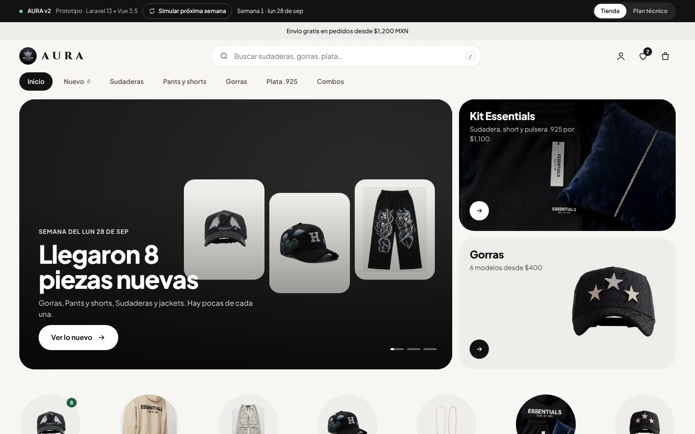
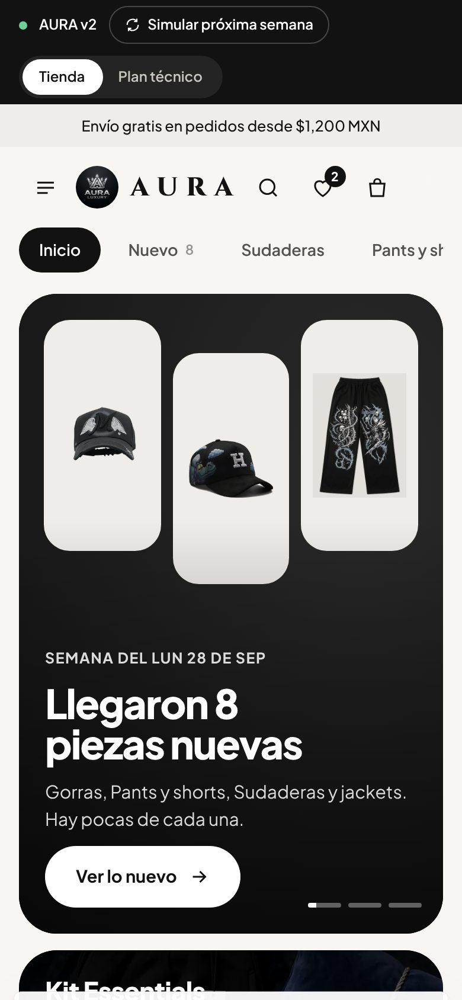
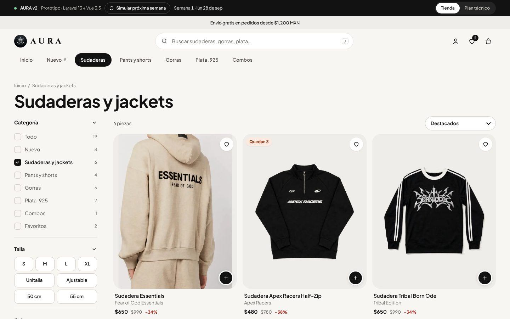
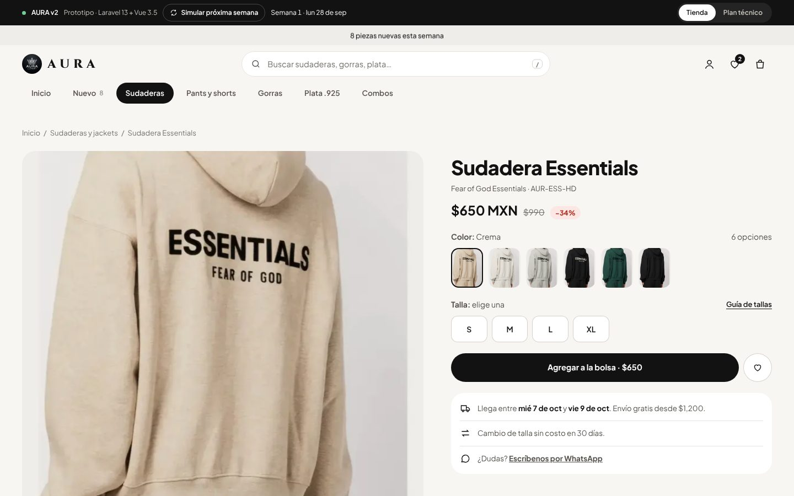

# AURA v2 · Propuesta

Propuesta para migrar la tienda de AURA a **Laravel 13 + Vue 3.5 (Inertia 3)** con panel de administración. Esta carpeta no cambia nada de la tienda actual; solo agrega documentación y un prototipo para revisarlos.

| Archivo | Qué es |
| --- | --- |
| [`PLAN-DE-DESARROLLO.md`](PLAN-DE-DESARROLLO.md) | Plan completo: alcance de v1, stack, arquitectura, modelo de datos, panel, reglas de negocio, infraestructura, migración del catálogo, pruebas, fases y riesgos |
| [`prototipo/aura-luxury-v2.html`](prototipo/aura-luxury-v2.html) | Prototipo navegable del diseño "escaparate claro" (un solo archivo, fotos incluidas) |
| `img/` | Capturas del prototipo y diagramas del plan |
| [`../../aura-v2-assets/products/`](../../aura-v2-assets/products/) | Las fotos actuales del catálogo convertidas a WebP (50 archivos, ~1.1 MB), listas para importarse |

## Cómo probar el prototipo

1. Descarga o abre `docs/aura-v2/prototipo/aura-luxury-v2.html` en Chrome, Safari o Edge (doble clic; no necesita servidor).
2. También está en línea: https://claude.ai/artifact/ASCTSrmwGY6BPV5BxLe4zU

Qué revisar:

- **Inicio:** banners, círculos de categorías, "Nuevo esta semana", "Más vendidos" con pestañas, "Completa el look", franja de Plata .925.
- **Catálogo:** filtros por categoría, talla, color y precio; "Cargar más". En celular los filtros salen en un panel inferior.
- **Producto:** colores con miniatura, tallas, zoom, "Agregar a la bolsa".
- **Bolsa y pago:** barra de envío gratis, deshacer al eliminar, pago en una página (en v1 el pago se reemplaza por "Enviar pedido por WhatsApp").
- **Buscador:** escribe o presiona `/`.
- **Simular próxima semana** (barra negra superior): demostración de cómo la home se reorganiza con el inventario. En v1 las secciones las controla el equipo desde el panel.
- **Plan técnico** (botón arriba a la derecha): resumen técnico dentro del prototipo.

Las existencias, fechas de publicación, ventas y tarifas de envío del prototipo son **datos de ejemplo**.

## Capturas

| Inicio | Móvil |
| --- | --- |
|  |  |

| Catálogo | Producto |
| --- | --- |
|  |  |
